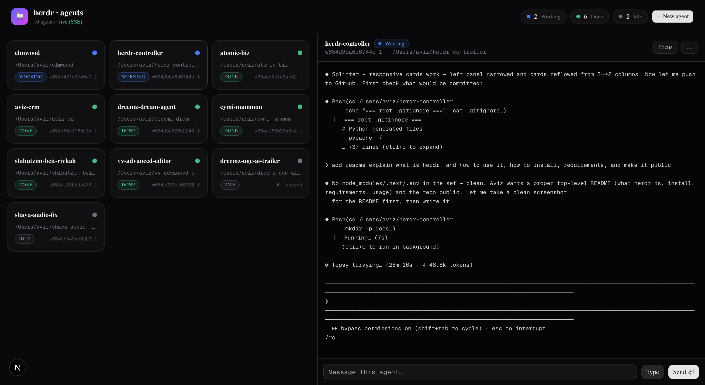

# herdr-controller

A **FastAPI backend + Next.js dashboard to control and observe an active
[herdr](https://herdr.dev) instance — focused on agents.**

List every agent in your herdr session, watch their status update live, read
their terminal output, send them messages, and spawn new agents — all from a
clean web UI or a plain HTTP API.



---

## What is herdr?

[**herdr**](https://herdr.dev) is a terminal-native multiplexer for AI coding
agents. It organizes your work into **workspaces → tabs → panes**, where each
pane is a real terminal running its own shell, agent (Claude Code, etc.),
server, or log stream. herdr automatically detects agents and tracks their
status (`idle` / `working` / `blocked` / `done` / `unknown`).

Critically, herdr exposes a local **unix-socket API**, and its `herdr` CLI
speaks to the running instance over that socket — `herdr agent list`,
`herdr pane read`, `herdr agent start`, and so on, all return JSON.

**herdr-controller wraps that CLI in an HTTP server** so the live agent fleet
can be driven from a browser, a script, a phone, or another agent — anything
that can make an HTTP request.

## What this project gives you

- **`app/` — FastAPI backend.** A thin async layer over the `herdr` CLI. Every
  endpoint shells out to `herdr`, parses the JSON envelope, and returns it.
  No state of its own; herdr is the source of truth.
- **`web/` — Next.js + shadcn/ui dashboard.** A modern dark control panel:
  - Live agent grid with status badges and a pulsing dot for working agents
  - Status rollup (how many working / done / idle) in the header
  - Click an agent to mirror its terminal output (auto-refreshing)
  - Send messages / commands straight into an agent's terminal
  - **`+ New agent`** — spawn a real agent into a new herdr pane from the UI
  - **Draggable split** between the agent picker and the terminal
  - Responsive auto-fill card grid
  - Per-line **RTL** rendering (Hebrew lines right-align automatically)
  - Live updates via **Server-Sent Events**, with a polling fallback

## Requirements

- **[herdr](https://herdr.dev)** installed and running, with the `herdr` binary
  on your `PATH`. The backend must run **on the same machine** as herdr (it
  talks to herdr's local socket via the CLI).
- **Python ≥ 3.14** and **[uv](https://docs.astral.sh/uv/)** for the backend.
- **Node.js ≥ 20** and npm for the dashboard.

## Install

```bash
git clone https://github.com/aviz85/herdr-controller.git
cd herdr-controller

# backend deps
uv sync

# dashboard deps
cd web && npm install && cd ..
```

## Run

Two servers, side by side. (Tip: if you're inside herdr, run each in its own
pane — `herdr pane split … --direction right`.)

**1. Backend — FastAPI on :8791**

```bash
PORT=8791 uv run uvicorn app.main:app --host 127.0.0.1 --port 8791
# or:  uv run herdr-controller     (honors HOST / PORT / RELOAD env vars)
```

Interactive API docs: <http://127.0.0.1:8791/docs>

**2. Dashboard — Next.js on :3939**

```bash
cd web
npm run dev -- --port 3939
```

Open <http://localhost:3939>.

> The dashboard talks to the backend at `http://127.0.0.1:8791` by default.
> Override with `NEXT_PUBLIC_HERDR_API` (e.g. in `web/.env.local`).
> The backend only accepts browser requests from a localhost allowlist
> (CORS) — extend it with `HERDR_ALLOWED_ORIGINS=https://your.host` if needed.

## API

| Method | Path | Description |
|---|---|---|
| GET | `/health` · `/status` · `/summary` | Liveness, raw herdr status, agent rollup |
| GET | `/agents` | List agents (`?status=working\|idle\|blocked\|done\|unknown`) |
| GET | `/agents/stream` | **SSE** — pushes the agent list on every status change |
| GET | `/agents/{target}` | One agent's info |
| GET | `/agents/{target}/read` | Read terminal text (`?source=recent&lines=200`) |
| GET | `/agents/{target}/explain` | herdr's structured state explanation |
| POST | `/agents/{target}/send` | Type text. `{"text":"…","enter":true}` to submit |
| POST | `/agents/{target}/focus` | Focus the agent's pane |
| POST | `/agents/{target}/rename` | `{"name":"…"}` or `{"name":null}` to clear |
| POST | `/agents/{target}/wait` | Block until a status. `{"status":"done","timeout_ms":60000}` |
| POST | `/agents/start` | Spawn an agent (`name`, `cwd`, `split`, `focus`, `argv`) |
| GET/POST/DELETE | `/workspaces`, `/panes`, … | Workspace + pane control |

A **target** is anything herdr accepts: a pane id (`w654…-1`), a unique agent
name, or a detected agent label.

### Examples

```bash
B=http://127.0.0.1:8791

curl -s $B/summary | jq                                  # fleet overview
curl -s "$B/agents?status=working" | jq '.agents[].cwd'  # busy agents
curl -s "$B/agents/elmwood/read?lines=40"                # mirror a terminal

# message an agent and submit it
curl -s -X POST $B/agents/elmwood/send \
  -H 'content-type: application/json' \
  -d '{"text":"run the tests","enter":true}'

# spawn a fresh claude agent in a new split
curl -s -X POST $B/agents/start \
  -H 'content-type: application/json' \
  -d '{"name":"claude","split":"right","focus":false}'

curl -N $B/agents/stream                                 # live status feed
```

## Architecture

```
Browser (Next.js dashboard, :3939)
        │  fetch / EventSource
        ▼
FastAPI backend (app/main.py, :8791)
        │  app/herdr.py — async subprocess wrapper
        ▼
   herdr CLI ──unix socket──> running herdr server ──> agents
```

- `app/herdr.py` — runs `herdr` commands, parses the `{"result": …}` /
  `{"error": …}` envelopes (errors arrive on stderr), maps failures to
  `HerdrError`.
- `app/models.py` — Pydantic request bodies.
- `app/main.py` — routes; `HerdrError` → HTTP 404 / 502 / 504.

Responses pass herdr's JSON through verbatim, so the shapes always match the
installed herdr version.

## Security notes

This API can spawn agents and type commands into terminals, so it is **not**
meant to be exposed publicly. It binds to `127.0.0.1` by default and restricts
browser origins via a CORS allowlist. If you put it on a network, add
authentication (e.g. a bearer-token FastAPI dependency) in front of it.

## License

MIT
